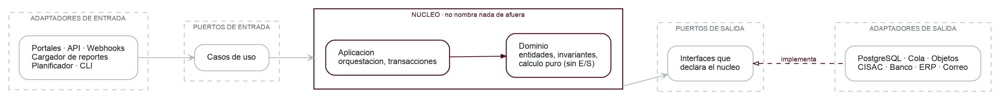

<!-- markdownlint-disable MD001 MD033 MD041 -->
<p align="center">
  <picture>
    <source media="(prefers-color-scheme: dark)" srcset="docs/intelia-logo-dark.png">
    
  </picture>
</p>

<h3 align="center">
Reconocimiento de obras y distribucion de ingresos por propiedad intelectual para REDES SGC,
la sociedad de gestion colectiva de los escritores audiovisuales de Colombia.
</h3>

<p align="center">
  <a href="./docs/architecture/"><b>Arquitectura</b></a> ·
  <a href="./docs/dominio/"><b>Dominio</b></a> ·
  <a href="./docs/decisiones/"><b>Decisiones</b></a> ·
  <a href="https://intela.sbs/"><b>Sitio</b></a> ·
  <a href="https://redescritores.com"><b>REDES SGC</b></a>
</p>

## Intela

REDES SGC cobra por el uso de obras audiovisuales y reparte lo recaudado entre los escritores que
las escribieron. Hoy ese cruce —que reporte corresponde a que obra, y que porcentaje le toca a
cada quien— se hace a mano. Intela lo automatiza sin perder la trazabilidad que exige el
reglamento: **toda cifra que el sistema produzca debe ser explicable hasta su origen** (fuente,
reporte, regla aplicada).

---

## Arquitectura

<p align="center">
  <picture>
    <source media="(prefers-color-scheme: dark)" srcset="docs/diagrams/arquitectura-dark.png">
    
  </picture>
</p>

Puertos y adaptadores con la regla de dependencia de Clean Architecture: **nada del nucleo nombra
nada de afuera.** Los cuatro invariantes de arriba dejan de ser disciplina y pasan a ser
estructura — el tipo `ReporteDeUso` no tiene campo de dinero, asi que la operacion de sumar
importes por fila sencillamente no existe.

Por dentro es un **monolito modular**: los contextos delimitados tienen frontera real, pero no hay
limite de proceso entre ellos. El perfil de carga es un pico anual, no alto trafico. Y el reparto
es **un flujo con compuertas humanas**, no un job por lotes: el dinero no sale con una sola firma.

→ **[`./docs/architecture/`](./docs/architecture/)** para capas, puertos, modulos, stack y el diagrama
completo de tres paginas.

---

## Como empezar

Los scripts declaran sus dependencias en linea (PEP 723) y se ejecutan con `uv`. Cada uno resuelve
su propio entorno efimero, sin interferir con el stack de la aplicacion.

```bash
uv run --script src/scripts/sample.py               # perfila los archivos de muestra del cliente
uv run --script src/scripts/diagrama_arquitectura.py  # regenera el diagrama del README
```

`diagrama_arquitectura.py` y `diagrama_despliegue.py` necesitan Graphviz
(`apt install graphviz`). `convert_reglamentos.py` regenera `docs/reglamentos/` desde los PDF y
necesita `poppler-utils`.

### Integracion continua

Un solo workflow con disparadores, [`.github/workflows/ci.yml`](.github/workflows/ci.yml), orquesta
etapas reutilizables: lint y test de Go, frontera de arquitectura, build del frontend, imagenes
Docker, lint de Python y de los propios workflows. El unico check obligatorio en la proteccion de
`main` es el job agregador **`ci`**, asi que anadir una etapa no obliga a tocar la proteccion de
rama.

Cada etapa se salta sola mientras su capa no exista. Hoy, sin `go.mod` ni `web/`, solo corren las
de Python, workflows y nombre de rama; las demas se activan en el mismo commit que introduzca el
codigo.

Los hooks locales viven en [`lefthook.yml`](lefthook.yml) y corren un subconjunto de lo mismo antes
del commit y del push:

```bash
go install github.com/evilmartians/lefthook@latest   # o: brew install lefthook
lefthook install
```

Detalle de cada etapa, el porque del filtrado por ruta y lo que falta para que las etapas de Go y
frontend pasen: [`docs/ci.md`](docs/ci.md).

Al mergear a `main`, el mismo workflow publica las imagenes en GHCR y llega a un job de despliegue
que **todavia no despliega**: no hay proveedor decidido, asi que imprime el plan de release y los
secretos que necesitara. Donde se inyecta cada cosa: [`docs/cd.md`](docs/cd.md).

### Trabajar con un agente

Este repositorio esta preparado para que el desarrollo lo conduzcan agentes de codigo. Usa uno que
soporte **skills** (Claude Code, Codex, Gemini CLI): `.claude/skills/` carga el contexto de dominio
solo cuando la tarea lo toca, para no diluir el contexto util. Cada skill cita numeral de
reglamento; ante discrepancia **manda el reglamento**.

| Skill | Cuando se dispara |
| ----- | ----------------- |
| [`consultar-reglamentos`](.claude/skills/consultar-reglamentos/) | Hace falta el texto exacto o la cita de un numeral |
| [`ingesta-y-normalizacion`](.claude/skills/ingesta-y-normalizacion/) | Cargar o perfilar reportes, esquema canonico, boveda cruda |
| [`matching-de-obras`](.claude/skills/matching-de-obras/) | Cruzar reportes contra el catalogo maestro, alias, difuso, ONI |
| [`recaudo-y-tarifas`](.claude/skills/recaudo-y-tarifas/) | Tarifas por categoria, convenios, facturacion, la bolsa a repartir |
| [`reparto-y-distribucion`](.claude/skills/reparto-y-distribucion/) | Valorizacion, valor punto, deducciones, splits, liquidaciones |
| [`proceso-y-aprobaciones`](.claude/skills/proceso-y-aprobaciones/) | Etapas del `RD 13.5`, compuertas, doble firma, calendario |
| [`afiliacion-y-anticipos`](.claude/skills/afiliacion-y-anticipos/) | Socio contra Titular Administrado, padron IPI, anticipos |
| [`trazabilidad-y-auditoria`](.claude/skills/trazabilidad-y-auditoria/) | Bitacora, linaje de una cifra, `ExplicarCifra`, retencion |

`clean-architecture` y las once `golang-*` son skills **vendorizadas**, fijadas por hash en
[`skills-lock.json`](skills-lock.json) y enlazadas desde `.agents/skills/`. Son teoria general; las
ocho de arriba son especificas de Intela y de REDES SGC.

[`CLAUDE.md`](CLAUDE.md) es lo que el agente lee en cada sesion.

---
